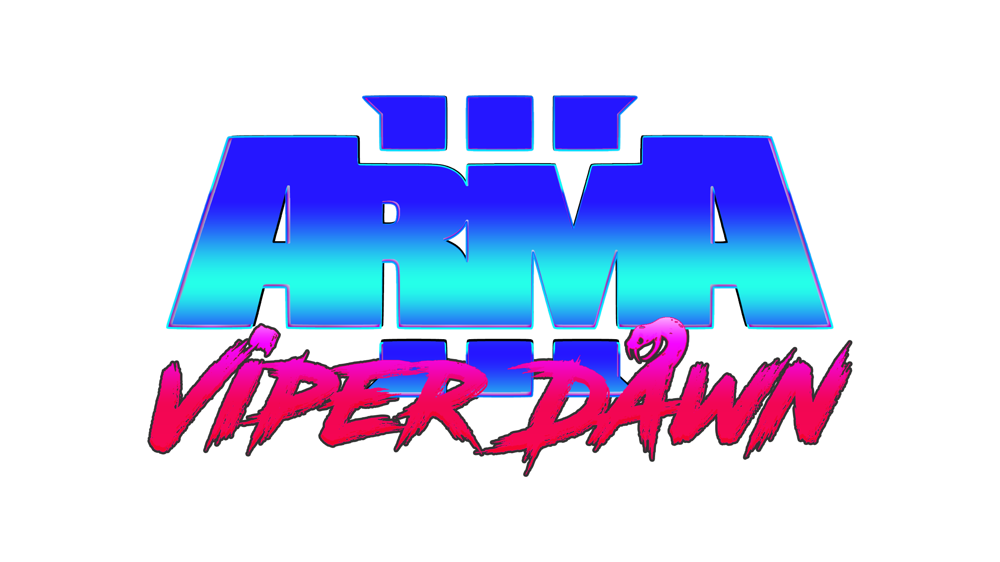

Arma 3 Viper Dawn
---

### Summary

The year is 2042; years of war have left most of the world in burning ruins. In the radioactive jungles of Tanoa, the ghosts of the Apex conflict return.

General Fang, the leader of Viper force has gone rogue and is threatening to nuke the world's ice caps, flooding the entire world.

The only chance of stopping Fang is to thaw out his old nemesis; Captain Miller, the man they put in Cryoprison for a crime he didn't commit.

Through the toxic swamps and wastelands Miller must battle his way past mutated animals, cannibals and Viper force; an elite army of super soliders.

Along the way Miller will come across old friends and new challenges as he tracks down General Fang to his secret base.

This is Viper Dawn!

### Gameplay Features

* First person style, with an arcade feel.
* Visuals will be retro themed with a purple / magenta hue. Re-texturing will be done where necessary.
* Miller will have a linear progression as he campaigns across the Tanoa wasteland.
* Health will be managed by a script with basic auto healing along with the ability to heal yourself with resupplies.
* Weapons will be tweaked to increase fire rate and explosiveness but reduced accuracy.
* Retro sound and ambient effects.
* Upgrades will be found around the island in specific locations.

### Main goals

* Retexture Viper forces in a new scheme
* Ambience scripts for Tanoa (fires, radiation, smoke, ruins)
* Post processing effects, magenta haze etc
* Miller retexture for that retro feel. 
* Basic mission to start off with, leading into a campaign that can be developed later
* Soundtrack [Retro Synth](https://www.youtube.com/watch?v=ovzRrrLvW1M_)
* Confuse the player as much as possible and possibly give them epilepsy

### Extra goals

* Dialogue and voice recordings
* Branding
* Custom weapon models and vehicles

### Characters

More info can be found [here](docs/characters.md)

### Animals:

* Blood Rabbits - Dragons you say? This isn't some cheesy 80s scifi game! Stay away from these little critters.
* Neo Snakes - Is that a snake in the forest or are you just happy to see me? No its a snake in the forest...

### Location:

Tanoan Wasteland - Tanoa will never be the same after Vietnam war 2. Those who still live on the island have to deal with radiation, warring tribes of mutated cannibals, dangerous animals and Viper force.
It appears that the nukes also turned the sky into a purple haze, like we're in that cool episode from Black Mirror. 

Around the island there are many locations that Miller can explore by foot or vehicle.

### Weapons and Equipment:

* Patriot 9000 - this small handgun is Miller's go to choice, reliable and deadly.
* Longslide XRW - sharpshooter rifle with explosive chemrounds and a large scope.
* Pulse SMG - sprays and also does the praying for you, unless you are a godless commie.
* Maverick 24 gauge - what's better than a 12 gauge shotgun? A 24 gauge shotgun!
* The Cheetah - high powered rifle with a multiphasing scattercast light on the red spectrum a.k.a. laser pointer.
* Laser Designator - allows Miller to call in death from above.

### Items:

* Bandanas - fashionable but also have the spiritual powers of fallen warriors, different colours give different benefits (armor, speed, stealth). There ain't no unlimited ammo one though pal!
* Bananas - full of potassium
* Medpacks - no explanation needed
* Freedom Magazine - Miller's favourite publication, various issues located around the island of Tanoa

### Vehicles:

* Hypercopter - transport helicopter to get you in and out of the battlefield whilst playing some classic Rock n Roll
* Robotank - less likely to shoot friendly units since the latest patch against the CyberWorm 4000
* Jeep - a jeep!
* Quadbike - a quadbike but with a cool retro paintjob

### Themes and Concepts:

lone wolf, action, revenge, self discovery, love, trial, apocalyptic, retro, maverick

### Movie Inspirations:

[Youtube Playlist](https://www.youtube.com/playlist?list=PLKLMRoF6Be0WoIGtFEpjAcdNMChqwzuOv)

### Help

This is an early stage project, if you could advise or contribute in anyway that would be appreciated!

### Licence

Arma 3 and Armed Assault are trademarks and copyright of 
[Bohemia Interactive](https://www.bohemia.net/).

This is a personal project which is a modification of the Arma 3 game.